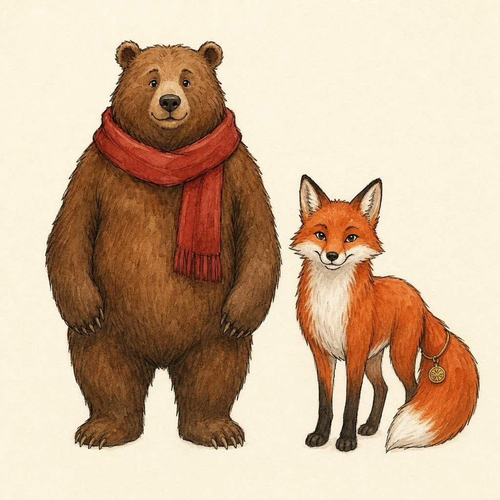
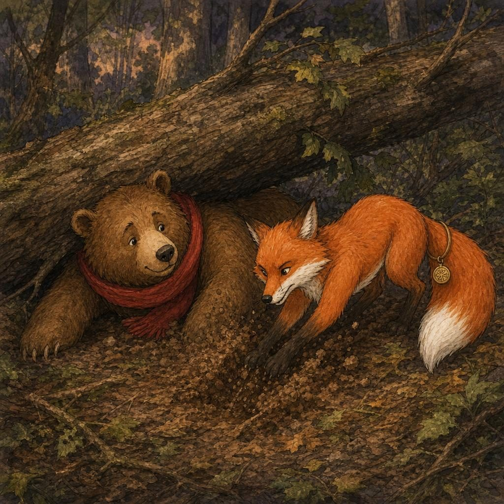
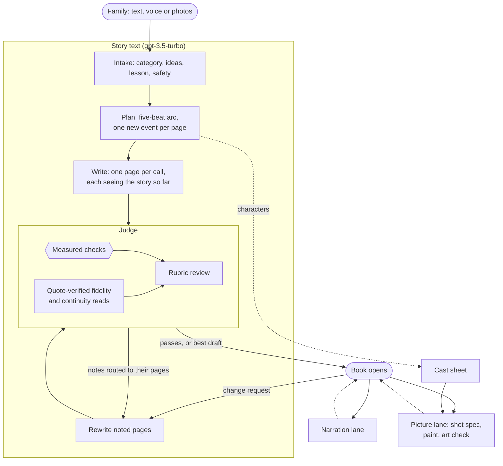

# Uncle Pie's Storybook

[](https://github.com/prassu017/uncle-pie-storybook/actions/workflows/tests.yml)


[](https://uncle-pie-storybook.vercel.app)
[](LICENSE)

**Bedtime stories for ages 5 to 10, written by a storyteller agent and checked by an editor agent.**
Tell Uncle Pie an idea (type it, say it, or add photos of the people and pets who should star in it).
He plans and writes the story, his editor Vishnu reviews every draft until it is right for a young
listener, and the finished book is painted page by page in ink and watercolour while it is read aloud.

<p align="center">
  
  
</p>

**[Try it live](https://uncle-pie-storybook.vercel.app)** ·
**[Architecture](https://uncle-pie-storybook.vercel.app/architecture.html)** ·
**[Sample stories](samples/)** · **[Docs](docs/)**

## Features

- **Any request, any length.** A one-word topic, a full plot, or a parent's specific need ("my son is
  scared of thunderstorms"). Each plot idea in the request is checked against a quoted sentence in the story.
- **Three drafts, the best one kept.** Uncle Pie writes three versions in parallel; code ranks them and
  the judge compares the top two side by side (both ways round) before revision starts.
- **An LLM judge that improves the story.** Vishnu combines measured checks with quote-verified reviews
  (including two independent continuity reads) and sends page-specific notes back until the draft passes,
  then prints the best draft.
- **A story ledger, checked in code.** After each page, what happened and who appeared are recorded; a
  page that repeats an earlier event, or brings in a character "from nowhere", is rewritten.
- **Easy to read aloud.** A final pass simplifies any page that is too hard for a five-year-old, keeping
  every event and every requested idea.
- **Story arcs and categories.** Eight story types (fable, friendship, adventure, funny, mystery,
  discovery, feelings, calm), each with its own strategy, on a five-beat arc.
- **Change requests.** "Make Bob funnier and add a baby squirrel" rewrites the story and re-reviews it.
- **Text first.** The book opens as soon as the text passes review; narration and illustrations follow
  in parallel and never hold up reading.
- **Illustrated and narrated.** A shared character sheet keeps characters consistent across pages; an
  art editor checks every picture shows its moment. Pages draw themselves in the browser.
- **Voice and photo input.** Speak the idea, or add photos to inspire the characters.
- **Bookshelf.** Every finished book is kept in the browser to read again.
- **Safe by design.** Moderation, gentle reframing of unsuitable requests, prompt-injection guards, and
  photos that are never stored.

## Quick start

Requires Python 3.10+ and an OpenAI API key.

```bash
git clone https://github.com/prassu017/uncle-pie-storybook.git
cd uncle-pie-storybook
pip install -r requirements.txt
cp .env.example .env            # then add your key, or export OPENAI_API_KEY directly
```

```bash
python main.py                                    # interactive: tell a story, then ask for changes
python main.py "a shy turtle who wants to win the race"            # one-shot, text only
python main.py "a shy turtle who wants to win the race" --out book --media   # with narration and pictures
python dev_server.py                              # web app at http://127.0.0.1:4620
```

Command-line options:

| Flag | Effect |
|---|---|
| `--out DIR` | Save `story.json` (and any media) to `DIR` |
| `--audio` | Also record narration |
| `--images` | Also paint the cast sheet and illustrations |
| `--media` | Both, running in parallel |

## Configuration

| Variable | Default | Purpose |
|---|---|---|
| `OPENAI_API_KEY` | (required) | OpenAI key. Never commit it. |
| `OPENAI_API_KEY_FILE` | | Path to a file holding the key, instead of the variable above |
| `APP_PASSCODE` | unset | If set, the web API requires this passcode (`X-Passcode` header) |
| `WRITER_MODE` | `pages` | `pages`: one call per page; `whole`: the whole story in one call, split by code |
| `IMAGE_MODEL` | `gpt-image-2` | Illustrations and cast sheet |
| `VISION_MODEL` | `gpt-4.1-mini` | Art editor and photo reader |
| `TTS_MODEL` / `TTS_VOICE` | `gpt-4o-mini-tts` / `ballad` | Narration |
| `STT_MODEL` | `gpt-4o-mini-transcribe` | Voice input |

The story model is fixed: all story writing and judging use **gpt-3.5-turbo** through `call_model` in
[`storybook/llm.py`](storybook/llm.py). Other models handle only what a text model cannot do: drawing,
seeing, speaking and listening.

## How it works



Hexagons are deterministic code; rectangles are model calls. Code makes every decision that must be
reliable (which idea goes on which page, whether a draft passes, which draft is printed); models do the
writing and judging. Full details: **[docs/architecture.md](docs/architecture.md)**.

### The agents

| Agent | Role | Named after |
|---|---|---|
| **Ranganathan** | Intake: classifies the request, extracts the family's ideas and lesson | S. R. Ranganathan, father of library classification |
| **Uncle Pie** | Storyteller: plans, writes, revises; writes each picture's shot spec | Anant "Uncle" Pai, creator of *Amar Chitra Katha* |
| **Vishnu** | Editor and judge | Vishnu Sharma, author of the *Panchatantra* |
| **Ida** | Fidelity auditor: quotes where each requested idea happens | Ida Tarbell, evidence-first journalist |
| **Caldecott** | Illustrator | Randolph Caldecott, father of the modern picture book |
| **Ursula** | Art editor: checks each picture shows its moment | Ursula Nordstrom, children's picture-book editor |
| **Ameen** | Narrator | Ameen Sayani, pioneering radio storyteller |
| **Homai** | Reads family photos (appearance only, never identity) | Homai Vyarawalla, India's first woman photojournalist |
| **Pitman** | Transcribes spoken ideas | Isaac Pitman, inventor of shorthand |

## Project structure

```
main.py                     Command-line entry point
storybook/
  llm.py                    gpt-3.5-turbo wrapper, JSON validation with retry, moderation
  prompts.py                Every prompt in one place
  pipeline.py               Intake, plan, write, judge and revise loop; shot specs
  readability.py            Measured checks and the limits shared by writer and judge
  orchestrator.py           Narration and picture lanes, report card
  media.py                  Illustration, art editor, narration, transcription, photo reading
api/index.py                HTTP API (FastAPI; deployed as a Vercel Python function)
public/                     Web app; draw.js renders the ink-and-watercolour animation
tests/                      Offline test suite (no API calls)
samples/                    Generated stories with the judge's review rounds
tools/make_samples.py       Regenerates samples/
docs/                       Architecture, prompt design, evaluation, safety
```

## Testing

```bash
pip install -r requirements-dev.txt
python -m pytest
```

The suite runs offline with model calls replaced by fakes. It covers the measured checks, idea
assignment and note routing, quote verification, plan validation, the report card, failure handling in
the media lanes, and API input validation. It runs on every push via GitHub Actions.

## Deployment

The app deploys to Vercel as static files plus one Python function (`api/index.py`); see
[`vercel.json`](vercel.json). Set `OPENAI_API_KEY` in the project's environment variables, and optionally
`APP_PASSCODE`. Pushing to `main` deploys to production.

API endpoints (story and picture endpoints stream newline-delimited JSON progress events):

| Endpoint | Purpose |
|---|---|
| `POST /api/story` | Write and review a story |
| `POST /api/revise` | Apply a change request |
| `POST /api/cast` | Paint the character sheet |
| `POST /api/picture` | Shot spec, illustration and art check for one page |
| `POST /api/narrate` | Narration for one page |
| `POST /api/transcribe` | Voice input to text |
| `POST /api/report` | Report card for a finished book |
| `GET /api/health` | Status |

## Documentation

- [Architecture](docs/architecture.md): pipeline, lanes, judge, request lifecycle
- [Prompt and agent design](docs/prompting.md): prompting strategies and agent handoffs
- [Quality and evaluation](docs/evaluation.md): checks, samples, measured timings, known limitations
- [Safety and privacy](docs/safety.md)
- [Changelog](CHANGELOG.md)

## License

[MIT](LICENSE)
