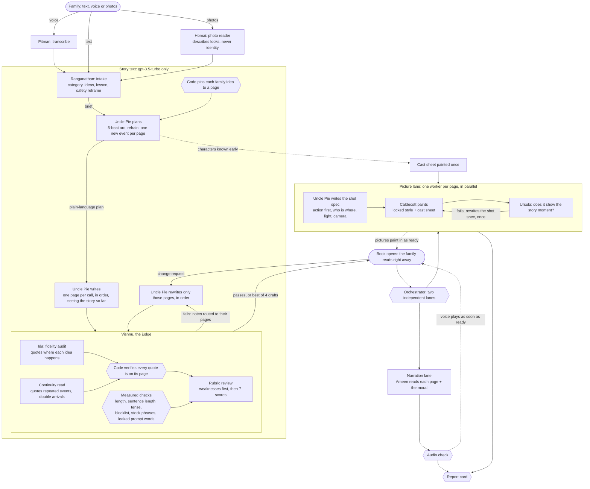
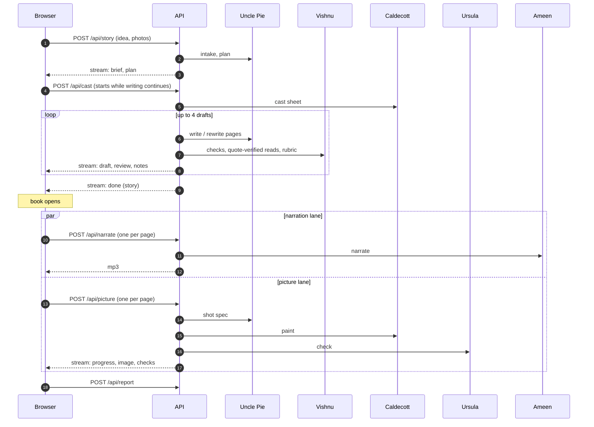

# Architecture

Uncle Pie's Storybook turns a bedtime-story request into a reviewed, illustrated, narrated picture book.
The design rests on one rule: **code decides, models write and judge.** Anything that must be reliable
(which idea goes on which page, whether a draft passes, which draft is printed, how failures are
handled) is deterministic Python. Models are used where creativity or judgement is needed.

## System flow

Hexagons are deterministic code; rectangles are model calls.

## Stages

| Stage | Module | What it does |
|---|---|---|
| Moderation gate | `pipeline._safety_gate` | Refuses requests in severe moderation categories with a kind message |
| Intake | `pipeline.intake` | Category, page count, characters (with pronouns), the family's ideas in order, the lesson, safety reframe |
| Idea assignment | `pipeline.assign_ideas` | Code pins each idea to a page in order, leaning late so a single idea lands on the turning point |
| Plan | `pipeline.plan` | Five-beat arc, a refrain, fixed character looks, and one *new* event per page (code rejects duplicates) |
| Write | `pipeline.write` | Three complete drafts in parallel, each written one page per call, seeing the story so far and its ledger; a page that repeats an earlier event is retried |
| Ledger | `pipeline.ledger_problems` | Per-page events and characters, extracted once and checked in code for repeats and characters from nowhere |
| Choose | `pipeline.choose_best` | Code ranks drafts by verified problems; the judge compares the top two side by side, both ways round |
| Judge | `pipeline.judge` | Measured checks, fidelity audit, continuity read, rubric; returns scores and page-specific notes |
| Revise | `pipeline.revise` | Rewrites only the pages with notes, in order, keeping a rewrite only if it is better |
| Read-aloud polish | `pipeline.simplify` | Simplifies pages that are too hard; kept only if easier, faultless, same content, and no requested idea is lost |
| Moral | `pipeline.write_moral` | Written from the finished story: names the characters and what they learned |
| Change request | `pipeline.revise_story` | "Add ..." requests become one page's required event and are verified; style changes apply to every page |
| Narration lane | `orchestrator.make_narration` | One request per page plus the moral; needs only the text |
| Picture lane | `orchestrator.make_picture` | Shot spec, illustration, art check, one redraw if needed |
| Report card | `orchestrator.report_card` | Deterministic score combining text, pictures and narration |

An alternative writer (`WRITER_MODE=whole`) writes the whole story in one call with page markers, which
code splits and checks with the same limits. Both modes were compared on the same requests; neither was
clearly better, so page-by-page is the default.

## Request lifecycle

Every prompt one agent hands another (intake to planner, planner to writer, judge notes to writer, shot
specs to the illustrator, the art editor's rewritten spec) is recorded and shown in the app's workshop view.

## Consistency across parallel pictures

Pages are painted in parallel, so three things keep them consistent:

1. **Locked style and character sheet.** Code wraps every shot spec in the same style text and the same
   character descriptions; agents only write the scene.
2. **Cast sheet.** All characters are painted once, side by side, and that image is passed to every
   picture worker as a reference. It starts as soon as the plan names the characters, overlapping the
   writing.
3. **Art check.** Ursula compares each picture against the required story moment and the character
   descriptions, describing what she sees first. A failing picture gets one redraw from a rewritten spec.

## Failure handling

- Every model reply is parsed and validated; on failure the exact problem is sent back for a retry.
- Writing limits steer the model but never stop a story: after retries, a page that still breaks a limit
  is accepted and sent back by the judge with a specific note.
- A judge failure after the first round keeps the drafts already made.
- In the media lanes, a failure on one page is reported and skipped; each lane always reports completion.
- Image, vision and voice calls wait and retry when rate-limited.

## Deployment

The web app is static files plus one Python function (`api/index.py`, FastAPI) on Vercel. Streaming
endpoints return newline-delimited JSON. Narration and picture requests are made per page from the
browser, which keeps each serverless call short and lets them run in parallel. The OpenAI key lives
only in an environment variable; `APP_PASSCODE` optionally locks the API.
